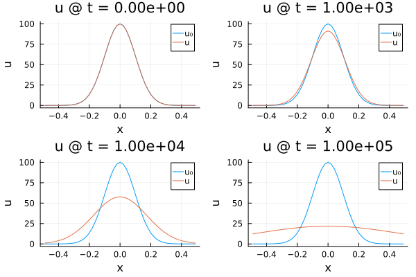
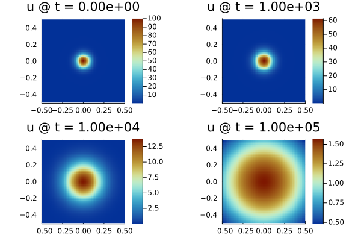
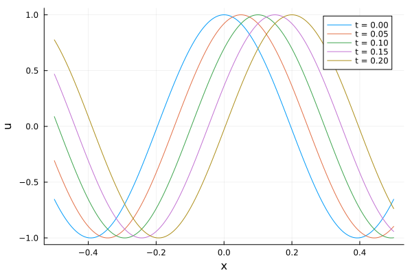
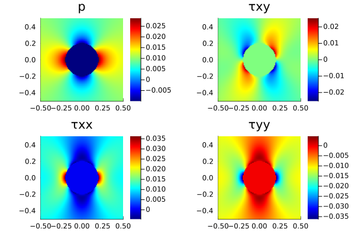

## ExactFieldSolutions.jl

Full field solutions are essential for the verification of numerical codes that are based on the solution of Partial Differential Equations (PDE).
They allow for checking if numerical solutions are meaningful in eyeball norm but, more importantly, they allow for the quantification of discretisation errors.
This quantification further enables to check whether numerical solutions converge to exact solutions at expected theoretical rates.
`ExactFieldSolutions` compiles full field solutions for 1D, 2D and 3D PDE problems including Poisson-type and mechanical problems (Stokes, elasticity).
Contributions are welcome and full field solutions to other problems (electric, magnetic, MHD) are more than welcome. Feel free to make a PR.

`ExactFieldSolutions` benefits from automatic differentiation tools available within the Julia ecosystem (e.g., ForwardDiff). These allow to evaluate fluxes and sources terms in a simplified way. [See this manufactured solution for the 2D Poisson problem](src/Poisson2D_Sevilla2018.jl).

Please note that `ExactFieldSolutions` is a registered package, so you can install it simply by typing `add ExactFieldSolutions` in package mode.

### Poisson 2D
[Sevilla et al. (2018)](examples/visualisations/Visualize_Poisson2D_Sevilla2018.jl)

")

### Poisson 3D
[Sevilla et al. (2018)](examples/visualisations/Visualize_Poisson3D_Sevilla2018.jl)

")

### Diffusion 1D
[Diffusion of a 1D Gaussian](examples/visualisations/Visualize_Diffusion1D_Gaussian.jl)

### Diffusion 2D
[Diffusion of a 2D Gaussian](examples/visualisations/Visualize_Diffusion2D_Gaussian.jl)

### Wave 1D 
[Propagation of a 1D wave based on d'Alembert's solution](examples/visualisations/Visualize_Wave1D_dAlembert.jl)

### Stokes 2D
[Viscous inclusion - Schmid & Podladchikov (2003)](examples/visualisations/Visualize_Stokes2D_Schmid2003.jl)

")

[Double corner flow - Moulas et al., (2021)](examples/visualisations/Visualize_Stokes2D_Moulas2021.jl)

")

[Donea & Huerta (2003)](examples/visualisations/Visualize_Stokes2D_Donea2003.jl)

")

[SolKz - Zhong et al. (1996)](examples/visualisations/Visualize_Stokes2D_SolKz_Zhong1996.jl)

")

[SolCx - Zhong et al. (1996)](examples/visualisations/Visualize_Stokes2D_SolCx_Zhong1996.jl)

")

### Elasticity 2D
[Elastic plate with a hole](examples/visualisations/Visualize_Elasticity2D_Hole.jl)

### Benchmarking

[1D diffusion: Finite Difference Method (FDM) with backward-Euler integration and spatial staggering](examples/benchmarks/Benchmark_Thermal1D.jl)

: backward-Euler and spatial staggering") 

[1D wave: Finite Difference Method (FDM) with velocity-stress discretisation](examples/benchmarks/Benchmark_Wave1D_VelStress_FDM.jl)

: velocity-stress scheme") 

[1D wave: Finite Difference Method (FDM) with conventional O(2) discretisation](examples/benchmarks/Benchmark_Wave1D_Conventional_FDM.jl)

: conventional O(2) discretisation") 